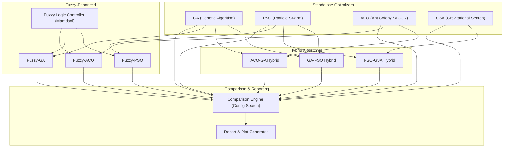

# PINN Benchmarks + Hyperparameter Optimization (HPO) Suite

Complete Physics-Informed Neural Network (PINN) benchmark and Hyperparameter Optimization framework comparing **Genetic Algorithms (GA)**, **Particle Swarm Optimization (PSO)**, **Gravitational Search Algorithm (GSA)**, **Ant Colony Optimization (ACO)**, **Fuzzy-Adaptive Search**, and **Hybrid Metaheuristics**.

## 🏛️ System Architecture



---

## 🔥 Evaluated PDE Benchmarks

- **ODE**: Exponential decay $\frac{dy}{dt} = -y$, $y(0) = 1$ (analytic solution: $y = e^{-t}$)
- **Burgers 1D**: Viscous Burgers equation $u_t + u u_x = \nu u_{xx}$ with shock dynamics
- **Heat Equation**: 1D diffusion $u_t = \alpha u_{xx}$ with Dirichlet boundaries
- **Allen-Cahn**: Phase-field equation $u_t = D u_{xx} + u - u^3$
- **Reaction-Diffusion**: Gray-Scott system (2D pattern formation)
- **2D Navier-Stokes**: Lid-driven cavity incompressible flow
- **Wave Equation**: 1D hyperbolic PDE $u_{tt} = c^2 u_{xx}$
- **Helmholtz**: Elliptic PDE $\nabla^2 u + k^2 u = f(x,y)$

---

## 🎯 8-Dimensional Hyperparameter Search Space

| Hyperparameter | Range / Options | Encoding |
| :--- | :--- | :--- |
| **Network Depth** | 1 to 6 hidden layers | Integer |
| **Network Width** | 8 to 256 neurons/layer | Integer |
| **Activation Function** | `tanh`, `sine` (Siren), `swish` (SiLU) | Categorical |
| **Optimizer** | `Adam`, `AdamW`, `L-BFGS` | Categorical |
| **Learning Rate** | $10^{-4}$ to $5 \times 10^{-2}$ | Continuous ($\log_{10}$) |
| **Physics Loss Weight** ($w_{phys}$) | 0.1 to 10.0 | Continuous |
| **Initial/Boundary Weight** ($w_{ic}$) | 0.1 to 50.0 | Continuous |
| **Collocation Points** | 64 to 1024 points | Integer |

---

## 🔬 Algorithm Categories

### 1. Standalone Metaheuristics
- **GA (Genetic Algorithm)**: Tournament selection, uniform crossover, random mutation, elitism.
- **PSO (Particle Swarm Optimization)**: Directional particle velocity updates with cognitive ($c_1$) and social ($c_2$) memory.
- **ACO (Ant Colony Optimization)**: Continuous ACOR with Gaussian kernel archive sampling.
- **GSA (Gravitational Search Algorithm)**: Agents attract via Newtonian gravity proportional to fitness masses; gravitational constant $G(t)$ decays over time.

### 2. Fuzzy-Adaptive Search (Fuzzy Logic Controller)
A Mamdani Fuzzy Inference System dynamically estimates population diversity, improvement rate, and search progress:
- **Fuzzy-PSO**: Dynamically adapts inertia weight $w(t) \in [0.3, 0.9]$ and social factor $c_2(t) \in [1.0, 2.5]$.
- **Fuzzy-GA**: Dynamically adjusts mutation rate $p_m(t) \in [0.05, 0.45]$ and crossover rate $p_c(t) \in [0.50, 0.95]$.
- **Fuzzy-ACO**: Dynamically adjusts dispersion $\zeta(t) \in [0.35, 1.20]$ and Gaussian sharpness $q(t) \in [0.15, 0.80]$.

### 3. Hybrid Metaheuristics
- **GA-PSO Hybrid**: Alternates between GA evolutionary exploration (crossover & mutation) and PSO particle velocity exploitation.
- **PSO-GSA Hybrid**: Unified velocity equation $V(t+1) = w V + c_1' r_1 a_{GSA} + c_2' r_2 (g_{best} - X)$ combining gravitational exploration with swarm exploitation (Mirjalili & Hashim).
- **ACO-GA Hybrid**: Uses ACO continuous archive for global exploration, then injects elite candidates to initialize GA for rapid schema recombination.

---

## 📁 Project Structure

```
d:/OptimizationOverviewPINN/
├── src/
│   ├── benchmarks/          # 8 PDE benchmark implementations
│   ├── models/              # Neural network architectures (MLP, Siren, activations)
│   ├── training/            # PINN trainer & benchmark factory
│   ├── hpo/                 # Hyperparameter Optimization methods
│   │   ├── search_space.py      # 8-dim search space & decoding logic
│   │   ├── ga.py                # Genetic Algorithm
│   │   ├── pso.py               # Particle Swarm Optimization
│   │   ├── aco.py               # Ant Colony Optimization (ACOR)
│   │   ├── gsa.py               # Gravitational Search Algorithm
│   │   ├── fuzzy_controller.py  # Mamdani Fuzzy Logic Controller
│   │   ├── fuzzy_pso.py         # Fuzzy-Adaptive PSO
│   │   ├── fuzzy_ga.py          # Fuzzy-Adaptive GA
│   │   ├── fuzzy_aco.py         # Fuzzy-Adaptive ACO
│   │   ├── hybrid_ga_pso.py     # GA-PSO Hybrid
│   │   ├── hybrid_pso_gsa.py    # PSO-GSA Hybrid
│   │   ├── hybrid_aco_ga.py     # ACO-GA Hybrid
│   │   ├── comparison.py        # Config-style multi-seed search engine
│   │   └── report_generator.py  # Automated plots & Markdown report builder
│   └── utils.py             # File I/O and reproducibility utilities
├── scripts/
│   ├── run_baseline.py          # Baseline PINN runner
│   ├── run_all_benchmarks.py    # Run baselines on all 8 PDEs
│   ├── run_ga.py                # Standalone GA runner
│   ├── run_pso.py               # Standalone PSO runner
│   ├── run_aco.py               # Standalone ACO runner
│   ├── run_gsa.py               # Standalone GSA runner
│   ├── run_fuzzy.py             # Fuzzy optimizers runner (--method pso/ga/aco/all)
│   ├── run_hybrids.py           # Hybrid optimizers runner (--method ga_pso/pso_gsa/aco_ga/all)
│   ├── run_full_comparison.py   # Master benchmark suite & report generator
│   └── run_tests.py             # Unit test suite
├── outputs/
│   ├── comparison/              # Master comparison data, report, and plots
│   │   ├── plots/               # Convergence, boxplot, radar, heatmap figures
│   │   ├── hpo_comparison_results.json
│   │   └── HPO_INVESTIGATION_REPORT.md
│   └── ...                      # Individual optimizer results
└── tests/                       # Comprehensive unit & integration tests
```

---

## 🚀 Execution Guide (PowerShell / Command Line)

### 1. Full Reproducibility & Master Benchmark Grids
```powershell
# Master one-command reproduction (full comparison grid + convergence speed + LaTeX tables)
python scripts\reproduce_all.py
python scripts\reproduce_all.py --quick

# Full multi-algorithm comparison grid (13 algorithms across 4 PDEs, 3 seeds)
python scripts\run_full_comparison.py
python scripts\run_full_comparison.py --quick

# Focused 7-algorithm manuscript scope (56 runs, 2 seeds)
python scripts\run_manuscript_scope.py

# Dedicated high-resolution convergence speed & trajectory benchmark
python scripts\test_convergence_speed.py --evals 60
```

### 2. Novel Proposed Optimizers (F-MAGSO & PDE-Robust-DE)
```powershell
# Run Novel F-MAGSO (Fuzzy-Guided Multi-Stage Adaptive Gravitational Swarm Optimizer)
python scripts\run_f_magso.py ode
python scripts\run_f_magso.py heat --evals 80 --steps 1200
python scripts\run_f_magso.py burgers --evals 80 --steps 1200
python scripts\run_f_magso.py wave --evals 80 --steps 1200

# Run Novel PDE-Robust-DE (Physics-Informed Differential Evolution with Adaptive Scaling)
python scripts\run_pde_robust_de.py ode
python scripts\run_pde_robust_de.py heat --generations 10 --pop-size 20 --steps 1200
python scripts\run_pde_robust_de.py burgers --generations 10 --pop-size 20 --steps 1200
python scripts\run_pde_robust_de.py wave --generations 10 --pop-size 20 --steps 1200
python scripts\run_pde_robust_de.py ode --quick
```

### 3. Hybrid Metaheuristics
```powershell
# Run all three hybrids (GA-PSO, PSO-GSA, ACO-GA)
python scripts\run_hybrids.py ode --method all
python scripts\run_hybrids.py burgers --method all

# Run individual hybrid metaheuristics
python scripts\run_hybrids.py ode --method ga_pso
python scripts\run_hybrids.py heat --method pso_gsa
python scripts\run_hybrids.py wave --method aco_ga
```

### 4. Systematic Ablation Studies
```powershell
# 1. F-MAGSO component ablation (Full vs w/o FLC vs w/o GSA vs w/o GA-Schema vs w/o Multi-Stage)
python scripts\run_ablation.py ode --study f_magso
python scripts\run_ablation.py ode --study f_magso --quick

# 2. PDE-Robust-DE mechanics ablation (Full Adaptive vs Fixed DE vs Boundary Clipping)
python scripts\run_ablation.py ode --study pde_robust_de
python scripts\run_ablation.py ode --study pde_robust_de --quick

# 3. Fuzzy dynamic adaptation ablation (PSO vs Fuzzy-PSO, GA vs Fuzzy-GA, ACO vs Fuzzy-ACO)
python scripts\run_ablation.py ode --study fuzzy
python scripts\run_ablation.py ode --study fuzzy --quick

# 4. Hybrid synergy ablation (GA-PSO vs GA vs PSO; PSO-GSA vs PSO vs GSA; ACO-GA vs ACO vs GA)
python scripts\run_ablation.py ode --study hybrids
python scripts\run_ablation.py ode --study hybrids --quick

# Run all ablation studies in one pass
python scripts\run_ablation.py ode --study all --quick
```

### 5. Standalone & Fuzzy-Adaptive Optimizers
```powershell
# Standalone optimizers
python scripts\run_ga.py ode
python scripts\run_pso.py ode
python scripts\run_aco.py ode
python scripts\run_gsa.py ode

# Fuzzy-adaptive optimizers
python scripts\run_fuzzy.py ode --method all
python scripts\run_fuzzy.py heat --method pso
```

### 6. Test Suite & Validation
```powershell
# Run comprehensive unit test suite
python scripts\run_tests.py

# Cross-validate GA genetic operators against standard DEAP framework
python scripts\validate_ga_with_deap.py
```
